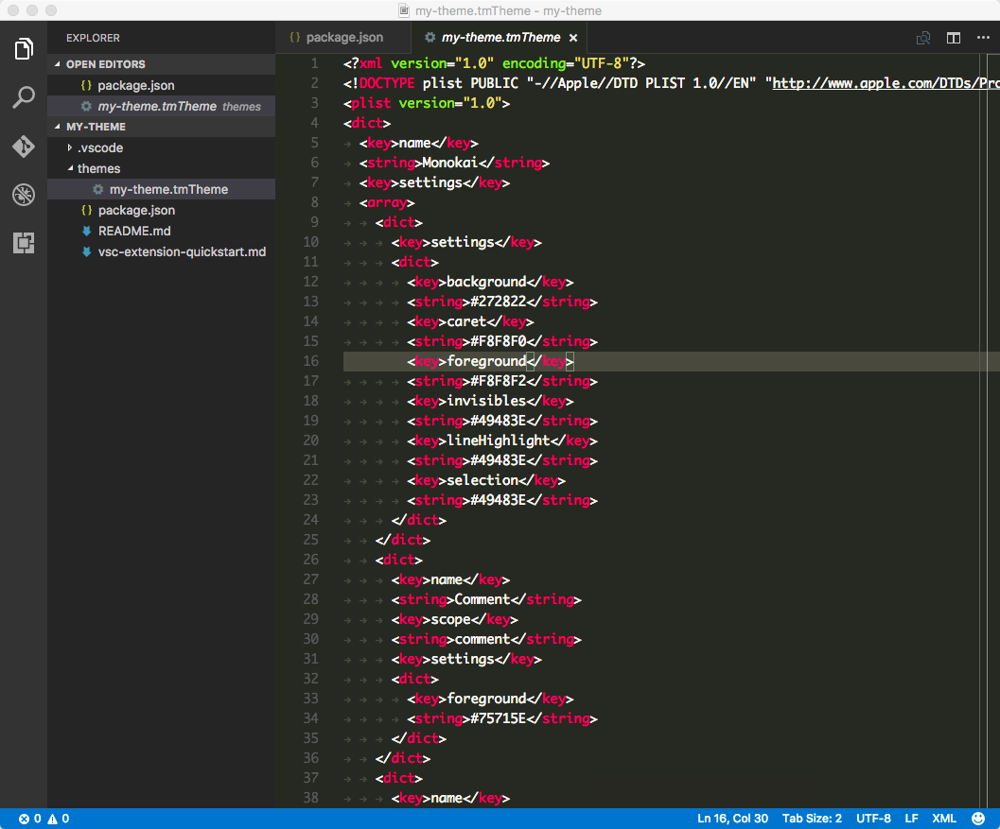
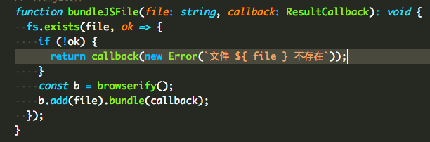

```
title: 如何打造一款属于自己的 Visual Studio Code 颜色主题
date: 2016-11-15
author: 老雷
link: https://github.com/leizongmin/lei-theme-vscode
```


## 前言

[Visual Studio Code](https://code.visualstudio.com) 是我在最近一年中最喜欢的一款编辑器，微软每一次的更新都会给大家带来惊喜，更是令人愈加喜欢。之前一直使用内置的颜色主题`Light+`和`Dark+`，但近来突然觉得前者颜色区分度不高，一眼看上去就密密麻麻的一对代码，而后者则是被选中的文本背景色太浅，跟编辑器的背景颜色很相似，很难区分出来，于是萌生了要制作一款自己的颜色主题的想法。经过几天的研究，终于捣鼓出来了[Lei Theme](https://github.com/leizongmin/lei-theme-vscode)系列颜色主题。

先来看看其中两款主题的效果：


一般来说，我们并不需要重头来制作一款颜色主题，首先需要选择一款自己最喜欢的颜色主题（或者说先找一款与自己的想法最相似的颜色主题），然后在此基础上进行些许调整即可。另外如果想将颜色主题发布到微软的 Visual Studio Code 扩展商店上，还需要注册一个微软开发者账号，并通过[vsce](https://www.npmjs.com/package/vsce)工具来发布出去，下文会对此进行详细说明。


## tmTheme 格式的颜色主题

TextMate曾是多年前最流行的代码编辑器之一，其颜色主题的文件后缀为`.tmTheme`，在本文中我们将其简称为`tmTheme`格式。Visual Studio Studio 的颜色主题采用的是标准的 TextMate 主题格式，我们可以参考这篇文章[Writing a TextMate Grammar: Some Lessons Learned](http://www.apeth.com/nonblog/stories/textmatebundle.html)，大概可以理解为这样：**编辑器对代码进行解析后，会为每个元素指定一个`scope`，这个`scope`即表明此元素是一个关键字还是一个常量，又或者是一个标点符号，通过`tmTheme`格式的文件来定义相应`scope`的文字样式。**

根据该文章可知道以下是常见的`scope`列表：

```
comment
constant
constant.character.escape
constant.language
constant.numeric
declaration.section entity.name.section
declaration.tag
deco.folding
entity.name.function
entity.name.tag
entity.name.type
entity.other.attribute-name
entity.other.inherited-class
invalid
invalid.deprecated.trailing-whitespace
keyword
keyword.control.import
keyword.operator.js
markup.heading
markup.list
markup.quote
meta.embedded
meta.preprocessor
meta.section entity.name.section
meta.tag
storage
storage.type.method
string
string source
string.unquoted
support.class
support.constant
support.function
support.type
support.variable
text source
variable
variable.language
variable.other
variable.parameter
```

以下是一个`tmTheme`格式文件的代码片段：

```xml
<dict>
  <key>name</key>
  <string>Keyword</string>
  <key>scope</key>
    <string>keyword.control,keyword.other,variable.language,storage.type,storage.modifier,keyword.function</string>
  <key>settings</key>
  <dict>
    <key>foreground</key>
    <string>#0808D1</string>
  </dict>
</dict>
<dict>
  <key>name</key>
  <string>Invalid</string>
  <key>scope</key>
  <string>invalid</string>
  <key>settings</key>
  <dict>
    <key>foreground</key>
    <string>#cd3131</string>
  </dict>
</dict>
```

从上面的代码可以看出，其实这个`tmTheme`格式的文件似乎也挺简单的，然而初学者而言，难的是**不知道`scope`怎么写**，下文会循序渐进地对此进行说明。

## 创建颜色主题项目

根据官方文档，我们先执行以下命令安装[Yeoman](http://yeoman.io/)代码生成工具来创建一个默认的颜色主题项目：

```bash
$ npm install -g yo generator-code
```

安装完毕之后，进入`~/.vscode/extensions`目录执行以下命令启动生成器：

```bash
$ yo code
```

说明：`~/.vscode/extensions`表示用户根目录下的`.vscode/extensions`目录，之所以在此处新建项目主要是为了不用发布到扩展商店也可以在本地进行使用，并且方便调试。

选择`New Color Theme`创建颜色主题项目：

```
     _-----_     ╭──────────────────────────╮
    |       |    │   Welcome to the Visual  │
    |--(o)--|    │   Studio Code Extension  │
   `---------´   │        generator!        │
    ( _´U`_ )    ╰──────────────────────────╯
    /___A___\   /
     |  ~  |
   __'.___.'__
 ´   `  |° ´ Y `

? What type of extension do you want to create?
  New Extension (TypeScript)
  New Extension (JavaScript)
❯ New Color Theme
  New Language Support
  New Code Snippets
```

接着需要在命令行下交互式地填写一些问题，以下是我在执行过程中填写的内容：

```
? What type of extension do you want to create? New Color Theme
URL (http, https) or file name of the tmTheme file, e.g., http://www.monokai.nl/blog/wp-content/asdev/Monokai.tmTheme.
? URL or file name: http://www.monokai.nl/blog/wp-content/asdev/Monokai.tmTheme
? What's the name of your extension? my-theme
? What's the identifier of your extension? my-theme
? What's the description of your extension?
? What's your publisher name? leizongmin
? What's the name of your theme shown to the user? my-theme
? Select a base theme: Dark
```

需要说明的是，第一个问题`URL (http, https) or file name of the tmTheme file`需要提供一个已有的`tmTheme`文件作为基础，此处可直接复制示例中的`URL`。

稍等片刻，工具自动生成了项目之后，会提示我们执行以下命令开始编辑代该项目：

```
$ cd my-theme
$ code .
```

以下是生成的项目的文件结构：

```
.
├── README.md
├── package.json （扩展信息文件）
├── themes
│   └── Monokai.tmTheme （颜色主题定义文件）
└── vsc-extension-quickstart.md （帮助文件，上面详细说明操作步骤）
```

首先看看`package.json`文件：

```json
{
  "name": "my-theme",
  "displayName": "my-theme",
  "description": "",
  "version": "0.0.1",
  "publisher": "leizongmin",
  "engines": {
    "vscode": "^1.5.0"
  },
  "categories": [
    "Themes"
  ],
  "contributes": {
    "themes": [
      {
        "label": "my-theme",
        "uiTheme": "vs-dark",
        "path": "./themes/Monokai.tmTheme"
      }
    ]
  }
}
```

`contributes`中定义了此扩展项目包含的内容，其中`themes`表示颜色主题，是一个数组，我们可在此处放入多个颜色主题。以下是`themes`中每个元素的定义：

+ `label`表示颜色主题的名称，即在`Preferences: Color Theme`列表中显示的名称
+ `uiTheme`是指编辑器 UI 的颜色，可选为`vs-light`和`vs-dark`，如果我们的颜色主题是深色系的，就选`vs-dark`
+ `path`是`tmTheme`文件的位置

为了避免混淆，我们可以将文件`./themes/Monokai.tmTheme`改名为`./themes/my-theme.tmTheme`，并修改`package.json`相应的位置。

现在在 Visual Studio Code 中按快捷键`⌘Command + Shift + P`打开命令面板（Windows / Linux 系统应为`Ctrl + Shift + P`），输入`Color Theme`并按回车，再中列表中选择`my-theme`按回车即可使用刚刚创建的新颜色主题：



从上图可以看出，这其实就是一个标准的`Monokai`主题。


## tmTheme 编辑器

从生成的`vsc-extension-quickstart.md`文件中我们得知有一款 Web 版的在线 [tmTheme 编辑器](https://tmtheme-editor.herokuapp.com)，通过该编辑器可以进行可视化地编辑 tmTheme 文件。比如以下视频是更改`String`和`Keyword`颜色的示例：

<video src="../../images/2016-11/tmtheme-editor-change-color.mp4" controls width="100%" loop="loop">你的浏览器不支持 <code>video</code> 标签.</video>

主要的操作方法为：

+ 在左侧`Scope Name`列表中选中一项，然后双击`FG`列上的颜色（FG 表示 foreground，即前景颜色），然后选择要更改的颜色即可，可以看到代码预览区域的颜色会实时改变
+ 点击顶部栏的【Download】按钮即可下载编辑后的`tmTheme`文件，直接将其覆盖项目中的`./themes/my-theme.tmTheme`文件即可
+ 在 Visual Studio Code 中按快捷键`⌘Command + Shift + P`打开命令面板，输入`Reload Window`并按回车即可看到修改后的颜色主题

但是，在一些实现细节上，Visual Studio Code 并不与该 tmTheme 编辑器一致，所以我们在该在线编辑器上看到的效果可能与 Visual Studio Code 上稍有不同，所以我们可能还需要直接编辑`tmTheme`文件。


## 如何知道 scope 是什么

下面是这款主题中，模板字符串的渲染效果：



从图中可以看到，模板字符串中的字符串和变量的颜色都是一样的，而假如我想改变模板字符串中变量的颜色，却是无从下手，因为即使翻遍 TextMate 官方文档中关于 tmTheme 的介绍也找不到模板字符串的`scope`是什么。

其实我们可以借助 Visual Studio Code 的开发者工具来找到任意元素的`scope`，以下是演示视频：

<video src="../../images/2016-11/vscode-developer-tools.mp4" controls width="100%" loop="loop">你的浏览器不支持 <code>video</code> 标签.</video>

从开发者工具中我们可以看到模板字符串中`${`的样式是：

```
token block ts punctuation definition meta string begin function arrow new expr template expression template-expression
```

而模板变量`file`的样式是：

```
token block ts meta variable other readwrite string function arrow new expr template expression
```

再结合文首对于`scope`介绍的文章，我们假设我们要的`scope`名为`template.expression`。接着打开文件`./themes/my-theme.tmTheme`，仿照该文件的格式，我们添加以下代码在对应位置：

```xml
<dict>
  <key>name</key>
  <string>Template Expression</string>
  <key>scope</key>
  <string>template.expression</string>
  <key>settings</key>
  <dict>
    <key>foreground</key>
    <string>#23C4FA</string>
  </dict>
</dict>
```

再按快捷键`⌘Command + Shift + P`打开命令面板，执行`Reload Window`，此时可以看到模板字符串中的变量颜色跟字符串的颜色不一样了：


## tmTheme 文件处理规则

尽管已经实现了我们想要的效果，相信阅读到这里的时候很多人还是一头雾水，并不知道为何`scope`是`template.expression`。我在刚开始时虽然也猜想到是像 CSS 的类选择器一样，但还是不太确定，直到阅读到 Visual Studio Code 的源码后才得以印证。

以下是[Visual Studio Code](https://github.com/Microsoft/vscode)源码中负责处理`tmTheme`的`scope`的程序文件`src/vs/workbench/services/themes/electron-browser/stylesContributions.ts`（[点此查看完整文件](https://github.com/Microsoft/vscode/blob/master/src/vs/workbench/services/themes/electron-browser/stylesContributions.ts#L93)）:

```typescript
export class TokenStylesContribution {

  public contributeStyles(themeId: string, themeDocument: IThemeDocument, cssRules: string[]): void {
    let theme = new Theme(themeId, themeDocument);
    theme.getSettings().forEach((s: IThemeSetting, index, arr) => {
      // @martin TS(2.0.2) - s.scope is already a string[] so no need for all this checking.
      // However will add a cast at split to keep semantic in case s.scope is wrongly typed.
      let scope: string | string[] = s.scope;
      let settings = s.settings;
      if (scope && settings) {
        let rules = Array.isArray(scope) ? <string[]>scope : (scope as string).split(',');
        let statements = this._settingsToStatements(settings);
        rules.forEach(rule => {
          rule = rule.trim().replace(/ /g, '.'); // until we have scope hierarchy in the editor dom: replace spaces with .

          cssRules.push(`.monaco-editor.${theme.getSelector()} .token.${rule} { ${statements} }`);
        });
      }
    });
  }

  private _settingsToStatements(settings: IThemeSettingStyle): string {
    let statements: string[] = [];

    for (let settingName in settings) {
      const value = settings[settingName];
      switch (settingName) {
        case 'foreground':
          let foreground = new Color(value);
          statements.push(`color: ${foreground};`);
          break;
        case 'background':
          // do not support background color for now, see bug 18924
          //let background = new Color(value);
          //statements.push(`background-color: ${background};`);
          break;
        case 'fontStyle':
          let segments = value.split(' ');
          segments.forEach(s => {
            switch (s) {
              case 'italic':
                statements.push(`font-style: italic;`);
                break;
              case 'bold':
                statements.push(`font-weight: bold;`);
                break;
              case 'underline':
                statements.push(`text-decoration: underline;`);
                break;
            }
          });
      }
    }
    return statements.join(' ');
  }
}
```

我们再来回顾一下上文`tmTheme`文件每一项`scope`的配置内容：

```xml
<dict>
  <key>name</key>
  <string>Template Expression</string>
  <key>scope</key>
  <string>template.expression</string>
  <key>settings</key>
  <dict>
    <key>foreground</key>
    <string>#23C4FA</string>
  </dict>
</dict>
```

其中第一项`name`表示的是我们给该规则起的名称；`scope`则是适用的`scope`，如果多个可以用逗号分隔，比如`User-defined constant`的`scope`值就为`constant.character, constant.other`；`settings`则是具体的样式信息，比如颜色值。

从源码中可以看出，支持的样式只有`foreground`和`fontStyle`，而`background`则从注释中可以看出由于某原因导致 Visual Studio Code 暂时不支持。

`scope`值为`template.expression`则可被认为是 CSS 类选择器`token.template.expression`，在前文的 Developer Tools 的演示视频中，模板字符串的变量名在渲染时其 HTML 为`<span class="token block ts meta variable other readwrite string function arrow new expr template expression">...</span>`，如果我们熟悉 CSS 的话应该能一眼就看出来`.token.template.expression`是会匹配到该标签的。所以，我们可以简单地把`scope`当作是 CSS 的类选择器。

需要注意的是，如果我们在定义`scope`时写得不够详细，可能会错误地匹配到其他元素，致使调好了一部分，另一部分却被调坏了，所以要做得完美也并非易事。


## 发布到扩展商店

要将扩展发布到扩展商店以便让更多人可以使用到，我们需要借助`vsce`命令行工具，可以参考文档[vsce - Publishing Tool Reference](https://code.visualstudio.com/docs/tools/vscecli)。以下是其基本步骤：

+ 安装 vsce 命令行工具。执行命令`npm install -g vsce`
+ 注册 Visual Studio Team Services 账号，并获取到 Access Token
+ 创建 Publisher。执行命令`vsce create-publisher`
+ 登录到 Publisher。执行命令`vsce login`
+ 发布扩展。执行命令`vsce publish`

详细操作步骤建议参考相应的官方文档。


## 后记

本文并没有详细到手把手教地去讲解如何打造一款 Visual Studio Code 颜色主题，仅仅是提到了几个我在折腾过程中认为比较关键，而又很难通过文档去查到的要点。爱折腾是程序员的天性，希望本文能让爱折腾的你少走一些弯路，把喜爱的 Visual Studio Code 玩出花来。


## 相关链接

+ [Visual Studio Code Themes - Adding a new Theme](https://code.visualstudio.com/docs/customization/themes#_adding-a-new-theme)
+ [Writing a TextMate Grammar: Some Lessons Learned](http://www.apeth.com/nonblog/stories/textmatebundle.html)
+ [vsce - Publishing Tool Reference](https://code.visualstudio.com/docs/tools/vscecli)
+ [Lei Theme for Visual Studio Code](https://github.com/leizongmin/lei-theme-vscode)
