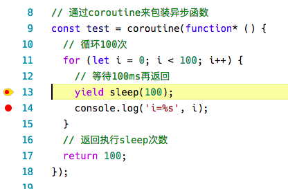

```
title: 基于 generator 与 promise 的异步编程解决方案
date: 2016-10-13
author: 老雷
```

##  前言

一直以来，“异步”编程问题一直困扰着广大的 JavaScript 开发者。近年来出现了各种异步解决方案，从基于最原始的`callback`方式的`async`函数，到`promise`标准，再到基于`generator`的`co`库，以及即将纳入 ES7 标准的`async function / await`语法，但是由于各种现实的原因，它们的表现并不尽人意。

原始的`callback`方式简单明了，不需要过多的依赖，但是在异步逻辑较复杂的场景下写出来的程序并不太直观，就我个人的使用经验而言，尽管多年来已经练就了一身可以穿梭在各种嵌套回调的“乱码”之中，每次重新看这些代码都头疼不已。

JavaScript 异步解决方案都是朝着更直观（跟写同步代码一样）的方向发展的，比如近来呼声最高的`async function / await`语法，直接从语言层面解决问题，使用体验那是好得没法说的。但是，这是一个 ES7 （ES2017，即明年才会发布的 ES 标准）标准的语法，目前并没有得到各 JavaScript 引擎的内置支持。虽然我们照样可以使用 Babel 神器来将它编译成 ES5 / ES6 的语法，然后运行在现有的 JavaScript 引擎之上。然而使用 Babel 编译后的代码并不易于维护，首先这些代码修改后要先经过一次编译，当我们在生产环境上执行编译后的代码时，很难准确地定位到源码出错的位置。另外，根据最新可靠的消息，Node  v7 版本会在语法层面上支持`async function / await`语法，但该版本原计划于 9 月 30 号发布却跳票了，而且按照往年的惯例，也要在 1 年后发布的 Node v8 LTS 版本上才会正式支持该语法，这对于追求稳定的企业来说还需要一个漫长的等待过程。

##  通过 Babel 编译 async function / await  语法解决方案

利用`async function / await`语法，我们可以很直观地书写异步程序：

```javascript
// sleep函数，返回一个Promise对象
function sleep(ms) {
  return new Promise((resolve, reject) => {
    setTimeout(resolve, ms);
  });
}

async function test() {
  // 循环100次
  for (let i = 0; i < 100; i++) {
    // 等待100ms再返回
    await sleep(100);
  }
}
```

但由于目前的 JavaScript 引擎均不支持该语法，需要通过 Babel 之类的工具编译成 ES6 语法后的程序是这样的：

```javascript
"use strict";

function _asyncToGenerator(fn) { return function () { var gen = fn.apply(this, arguments); return new Promise(function (resolve, reject) { function step(key, arg) { try { var info = gen[key](arg); var value = info.value; } catch (error) { reject(error); return; } if (info.done) { resolve(value); } else { return Promise.resolve(value).then(function (value) { return step("next", value); }, function (err) { return step("throw", err); }); } } return step("next"); }); }; }

function sleep(ms) {
  return new Promise((resolve, reject) => {
    setTimeout(resolve, ms);
  });
}

let test = function () {
    var ref = _asyncToGenerator(function* () {
        for (let i = 0; i < 100; i++) {
            yield sleep(100);
        }
    });

    return function test() {
        return ref.apply(this, arguments);
    };
}();
```

从编译后的代码来看，虽然在前面增加了一坨`_asyncToGenerator`函数的代码，但`test`函数的代码还是能看出程序原来的结构。通过以上凌乱的代码我们还是可以看出，其内部是通过`generator function`实现的，在外层返回一个`promise`对象。


## 基于 generator 与 promise 的解决方案

首先我们要达成这样的共识：**`async function / await`语法是未来的主流，但是要让主流的 JavaScript 引擎支持该语法还需要一个很漫长的过程，而现在我们需要找到一种替代的方法，而这种方法又能尽量保持与`async function / await`非常相近，在以后可以很轻易地替换成新的用法。** 基于以上的考虑可以得出以下结论：

+ 异步函数执行后需要返回一个`promise`对象（`async function`执行后返回的也是一个`promise`对象）
+ 使用`generator function`，`yield`代替`await`，这样可以最大程度上保持程序逻辑结构不变（`generator function`从 Node v4 已经开始支持，经过两年多的使用验证，性能和可靠性性上还是有保证的）

基于以上两点的考虑，我们可以假设新的异步代码应该是这样的：

```javascript
// sleep函数，返回一个Promise对象
function sleep(ms) {
  return new Promise((resolve, reject) => {
    setTimeout(resolve, ms);
  });
}

// 通过coroutine来包装异步函数
const test = coroutine(function* () {
  // 循环100次
  for (let i = 0; i < 100; i++) {
    // 等待100ms再返回
    yield sleep(100);
    console.log('i=%s', i);
  }
  // 返回执行sleep次数
  return 100;
});

 // 执行函数，其返回一个Promise对象
test()
  .then(i => console.log('执行了%s次sleep', i))
  .catch(err => console.error('出错', err));
```

对比直接使用`async function / await`语法，我们发现只是在声明异步函数和`yield`这两行写法不同，它可以在 Node v4 及更高版本上可直接执行，并且可以直接在源码上进行调试。以下是上文的程序在 Visual Studio Code 上进行调试的界面（`coroutine`函数的实现将在下文讲解）：




## 实现一个简单的 coroutine 函数

本小节只是是为了通过演示如何动手写一个`coroutine`函数来了解其中的原理，实际久经考验的`bluebird`模块和`co`模块已经实现了此功能，下一小节将会讲解基于这些现成模块的使用方法。

首先我们需要了解一下 Generator 的概念。Generator 中文名称为“生成器”，通过`function*`来定义的函数称之为“生成器函数”（`generator function`），而生成器函数执行后返回的是一个生成器对象（`Generator`），这个生成器对象包含了几个方法，其中一个重要的方法是`next()`，我们可以通过不断地调用`next()`来取得在生成器中`yield`出来的值，生成器是否已执行结束则可以通过返回值的`done`属性来判断。

生成器有一个特点就是它可以中断函数的执行，每次执行`yield`语句之后，函数即暂停执行，直到调用返回的生成器对象的`next()`函数它才会继续执行。以下是一个简单的例子：

```javascript
'use strict';

// 生成器函数，可以生成指定数量的数字
function* genNumbers(n) {
  for (let i = 1; i <= n; i++) {
    yield i;
  }
  return 'ok';
}

// 执行生成器函数
const gen = genNumbers(10);
while (true) {
  // 执行next()方法取下一个数字
  const ret = gen.next();
  // 打印结果
  console.log(ret);
  if (ret.done) {
    // 如果done=true则表示生成器执行结束
    break;
  }
}

console.log('done');
```

上面的代码执行后的结果如下：

```
{ value: 1, done: false }
{ value: 2, done: false }
{ value: 3, done: false }
{ value: 4, done: false }
{ value: 5, done: false }
{ value: 6, done: false }
{ value: 7, done: false }
{ value: 8, done: false }
{ value: 9, done: false }
{ value: 10, done: false }
{ value: 'ok', done: true }
done
```

说明：

+ 每次执行`next()`都会返回一个包含`{ value, done }`两个属性的对象，其中`value`是该次`yield`返回的值，`done`表示是否执行结束
+ 最后一次返回的值是生成器函数内`return`语句返回的值

从上文的代码可知，只有我们执行`gen.next()`时生成器才会继续执行。如果还不太确定，我们可以尝试把它换成异步的执行方式：

```javascript
'use strict';

// 生成器函数，可以生成指定数量的数字
function* genNumbers(n) {
  for (let i = 1; i <= n; i++) {
    yield i;
  }
  return 'ok';
}

// 执行生成器函数
const gen = genNumbers(10);

function next() {
  // 执行next()方法取下一个数字
  const ret = gen.next();
  // 打印结果
  console.log(ret);
  if (ret.done) {
    // 如果done=true则表示生成器执行结束
    console.log('done');
  } else {
    // 500ms后继续执行
    setTimeout(next, 500);
  }
}

next();
```

如无意外，执行上面的代码后我们应该能看到每隔 0.5 秒会打印出一行结果，直到 5 秒后程序才执行结束，而打印的结果跟之前的一模一样。

现在我们不妨假设，在我们的异步函数中，通过`yield`返回一个`promise`对象，然后等待`promise`执行回调后再执行`gen.next()`方法，如此循环，是不是就可以实现异步流程控制呢？

```javascript
const ret = gen.next();
if (ret.done) {
  // 执行结束
  resolve(ret.value);
} else {
  // 等待promise回调
  ret.value
    .than(() => ret.next())
    .catch(err => reject(err));
}
```

以下是这个简单`coroutine`函数的代码：

```javascript
'use strict';

// 判断是否为Promise对象，再次只简单判断该对象是否包含then和catch方法
function isPromise(p) {
  return p && typeof p.then === 'function' && typeof p.catch === 'function';
}

// coroutine函数，接收一个generator function作为参数，返回一个新的函数
function coroutine(generator) {
  return function () {
    // 函数执行结果是一个promise对象
    return new Promise((resolve, reject) => {
      // 首先执行generator function，它会返回一个Generator对象
      // 详细文档可参考https://developer.mozilla.org/zh-CN/docs/Web/JavaScript/Reference/Global_Objects/Generator
      const fn = generator.apply(null, arguments);
      let ret;
      function next() {
        // 执行.next()返回yield返回的值
        ret = fn.next();
        // 如果done=true则表示结束
        if (ret.done) {
          return resolve(ret.value);
        }
        // 如果返回的值不是promise则报错
        if (!isPromise(ret.value)) {
          return reject(new TypeError('You may only yield a promise, but the following object was passed: ' + String(ret.value)));
        }
        // 等待promise执行结果
        ret.value.then(next).catch(reject);
      }
      // 开始执行
      next();
    });
  };
}
```

说明：此代码仅用作演示，尽管通常情况下它也能正确地运行，但是并没有考虑性能问题和一些异常情况，生产环境下请使用稳定的 NPM 模块。

##  使用 bluebird 模块的 coroutine 函数

使用前先执行以下命令安装`bluebird`模块：

```bash
$ npm install bluebird --save
```

以下是基于`bluebird`模块的`coroutine`函数的使用方法：

```javascript
'use strict';

const Promise = require('bluebird');

const test = Promise.coroutine(function* (n, ms) {
  for (let i = 0; i < n; i++) {
    console.log('i=%s', i);
    yield Promise.delay(ms);
  }
  return n;
});

test(10, 500)
  .then(n => console.log('执行结束，n=%s', n))
  .catch(err => console.error('执行出错：', err));
```

说明：

+ `bluebird`自带了`delay()`函数，功能与上文实现的`sleep()`相同


## 使用 co 模块

使用前先执行以下命令安装`co`模块：

```bash
$ npm install co --save
```

以下是基于`co`模块的简单使用方法：

```javascript
'use strict';

const co = require('co');

function sleep(ms) {
  return new Promise((resolve, reject) => {
    setTimeout(resolve, ms);
  });
}

const test = co.wrap(function* (n, ms) {
  for (let i = 0; i < n; i++) {
    console.log('i=%s', i);
    yield sleep(ms);
  }
  return n;
});

test(10, 500)
  .then(n => console.log('执行结束，n=%s', n))
  .catch(err => console.error('执行出错：', err));
```

实际上`bluebird`模块和`co`模块还是有区别的：`bluebird`模块只支持`yield`一个`promise`对象，而`co`模块可以支持`promise`，`generator`，`array`，`object`和`Thunk`函数，可在异步函数内实现多个并发异步任务，比前者复杂得多。

## 后记

回想在过去的一年多时间里，我确实是对以使用`generator`的`co`模块来解决异步问题是有些许偏见，也曾喷过某**月饼云**的 Node.js SDK 竟然不支持`callback`而是直接返回一个`generator`。究其原因，我深以为有以下几点：

+ 早期版本的`co`封装并不是返回一个`promise`对象，再加上大多数介绍`co`的文章讲的基本上都是`thunks`的概念，这对初使用`co`的人是相当恶心的
+ `co` 的`yield`支持的功能实在太丰富了，而我更喜欢简单的
+ 在 Node v4 发布之前，使用 Generator 还需要开启 Harmony 特性
+ 从 Node v4 开始，直接支持了 Generator 和 Promise

最后一句，JavaScript 的世界变化实在太快了。


## 相关链接

+ [Generator 函数的含义与用法](http://www.ruanyifeng.com/blog/2015/04/generator.html)
+ [生成器](https://developer.mozilla.org/zh-CN/docs/Web/JavaScript/Reference/Global_Objects/Generator)
+ [你不懂JS: 异步与性能 第四章: Generator（上）](http://www.jianshu.com/p/d6ac6b0b41d6)
+ [你不懂JS: 异步与性能 第四章: Generator（下）](http://www.jianshu.com/p/e6f6766cba13)
+ [co 函数库的含义和用法](http://www.ruanyifeng.com/blog/2015/05/co.html)
+ [Koa, co and coroutine](http://lifemap.in/koa-co-and-coroutine/)

